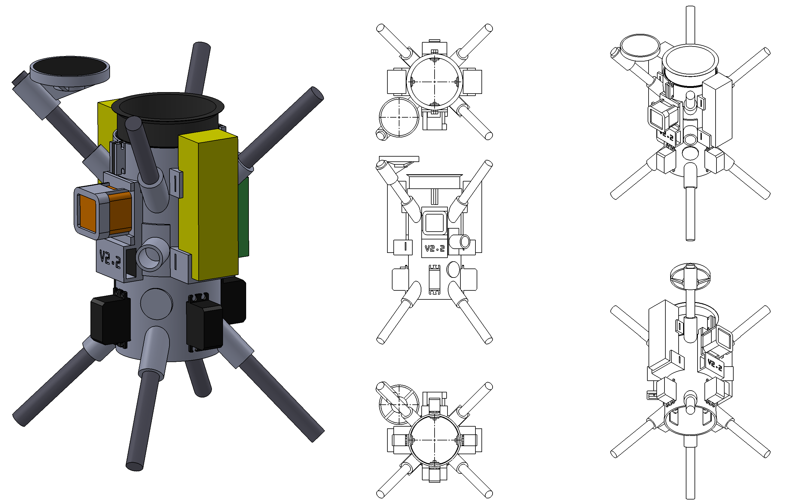
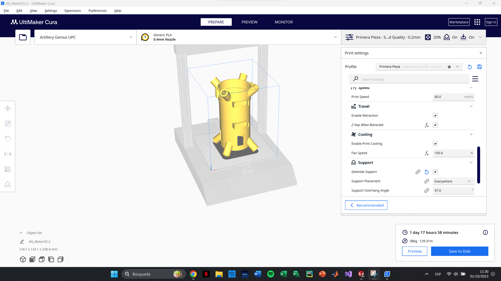
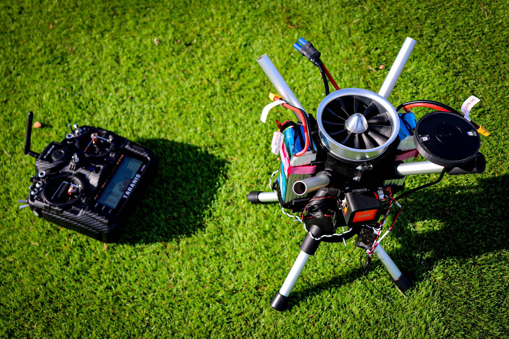

# SPARKY Thrust Vectoring System

### Development and manufacturing of a Thrust Vectoring System for reusable rocket dynamics research - Final Bachelor's Thesis

Author: Cristian Fernandez Dominguez

Advisors: Pablo Royo Chic & Ramon Casanella Alonso

Bachelor’s degree in Aerospace Systems Engineering

Castelldefels School of Telecommunications and Aerospace Engineering

## :red_circle: Introduction
Nowadays, the space industry is experiencing exponential growth, fueled by private companies and the conception of new and ambitious challenges. In recent years, the cost of reaching space has been drastically reduced, and to a certain extent, reusable rockets are to blame for that cost reduction.

Unfortunately, and it has always been so, the space industry has always required a lot of resources and funding, and even with the drastic cost reduction with the incorporation of this new type of rockets, the development of technologies by students and researchers from universities around the world is still very difficult.

To address this problem, this thesis will attempt, by reducing the cost to a maximum, to develop a system where it can study the dynamics of reusable rockets and be able to develop technologies around them.

To do this, an unmanned aircraft system (UAS) will be designed from scratch with the main objective of imitating the behavior of this type of rocket while trying to reuse as many components already used by the university as possible, helping to reduce costs, and helping the sustainability of the project itself.

Through the different chapters of this work, it can be seen, from the conception of the initial requirements and selection of the components, to the 3D design and subsequent manufacturing of the system itself, which will be calibrated and tested in different test flights, taking advantage of the university's facilities.

                

## :white_circle: Media Overview
In this repository you can find all the files related of this final bachelor's thesis. The files are organized as follows:

- [3D_Models](3D_Models) - This folder contains the `.stl` files for all components of Sparky. Utilizing these files, users with access to a suitable 3D printer can fabricate the individual parts and assemble them to create a functional UAS with VTOL capabilities.

- [3D_Sparky_Designs](3D_Sparky_Designs) - This folder gives access to the SolidWorks files of the different versions of Sparky and additionally to the Gimbal that works to calibrate the PIDs.

- [DataLogs](DataLogs) - This folder contains all the DataLogs in a `.bin` format of the different Flight Tests.

- [Images](Images) - Some cool images.

- [Parameters](Parameters) - This folder contains the different parameters used in the real flight tests in `.param` files.

In addition, a **YouTube channel** has been created to be able to upload the different videos of the test flights and a trailer that encompasses the entire project itself. The channel is [@CristianFernandezUPC](https://www.youtube.com/@CristianFernandezUPC/featured). 

The uploaded videos are:

- [Sparky Trailer](https://www.youtube.com/watch?v=5irSOpZRAP4)
- [Flight Test 1](https://www.youtube.com/watch?v=05G50puAUSE)
- [Flight Test 2](https://www.youtube.com/watch?v=WWrm3nAGPkM&t=1s)

## :large_blue_circle: Components

- [Mini Set The Cube Orange+](https://rc-innovations.es/shop/pixhawk-2-1-mini-set-the-cube-orange-plus#attr=8269)

- [FrSky Taranis X9D PLUS](https://rc-innovations.es/shop/frsky-taranis-x9d-plus-se-2019-access-2-4ghz-carbono#attr=7182)

- [Here 3 + GPS Module](https://rc-innovations.es/shop/here-3-plus-modulo-gps-gnss-m8p-2-pixhawk-2-istand?search=here+3#attr=7478)

- [Gens ACE LiPo Battery 2500mAh (x2)](https://rc-innovations.es/shop/gens-ace-6s-22-2v-2500mah-80c-bateria-lipo?page=3&category=356#attr=8748,8749,8747)

- [KingMax Digital Servo (x4)](https://rc-innovations.es/shop/kingmax-km5514mdhv-20mm-59g-13kg-digital-metalico-coreless#attr=8001,7999,8000,8002)

- [HSD Jets EDF 90mm Brushless Motor](https://rc-innovations.es/shop/a58010000j-hsd-jets-s-edf-90mm-brushless-motor-10579?page=4&search=EDF#attr=8259)

- [Hobbywing ESC 110A OPTO](https://rc-innovations.es/shop/esc-hobbywing-flyfun-hv-110a-v5-OPTO#attr=)

- [Holybro Telemetry Module V3](https://rc-innovations.es/shop/holybro-modulos-telemetria-sik-v3-433mhz-500mw?search=holybro+v3#attr=8351)

- [3DJake White Matte PLA 1000g (x2)](https://www.3djake.es/3djake/ecopla-mate-blanco)

- [Holybro PM02 V3 Power Module](https://rc-innovations.es/shop/modulo-alimentacion-pmu-holybro-pm02-v3-original-sensor-consumo-pmu?page=2&search=holybro#attr=7388)

- [20mm Bearings](https://www.amazon.es/dp/B09VZGCW9H?ref=ppx_pop_dt_b_product_details&th=1)

- [Montana Paint Primer Plastics](https://www.amazon.es/dp/B0826FCM71?psc=1&ref=ppx_pop_dt_b_product_details)

- [Hobbywing UBEC 3A](https://rc-innovations.es/shop/Hobbywing-ubec-3a?search=ubec#attr=)

- [Anodized aluminum tube Ø16mm (1m) (x2)](https://www.fesmes.com/es/perfiles-de-aluminio/295205005-tubo-redondo-aluminio-anodizado-plata-8013237011109.html)

- [Montana Matte Black Paint](https://www.amazon.es/dp/B008UGFJU2?psc=1&ref=ppx_pop_dt_b_product_details)

- [Anodized Aluminum Square Tube 20mm x 20mm (1m)](https://www.fesmes.com/es/perfiles-de-aluminio/295204000-tubo-cuadrado-aluminio-anodizado-plata-8013237011925.html)

- [Anodized aluminum tube Ø20mm (1m)](https://www.fesmes.com/es/perfiles-de-aluminio/295205005-tubo-redondo-aluminio-anodizado-plata-8013237011109.html)

- [XT30 Connector (pair) (x3)](https://rc-innovations.es/shop/Amass-conector-xt30-pareja?search=xt30#attr=)

- [EC5 Connector (pair)](https://rc-innovations.es/shop/Hobbywing-ubec-3a?search=ubec#attr=)

  

## :movie_camera: Project Images

